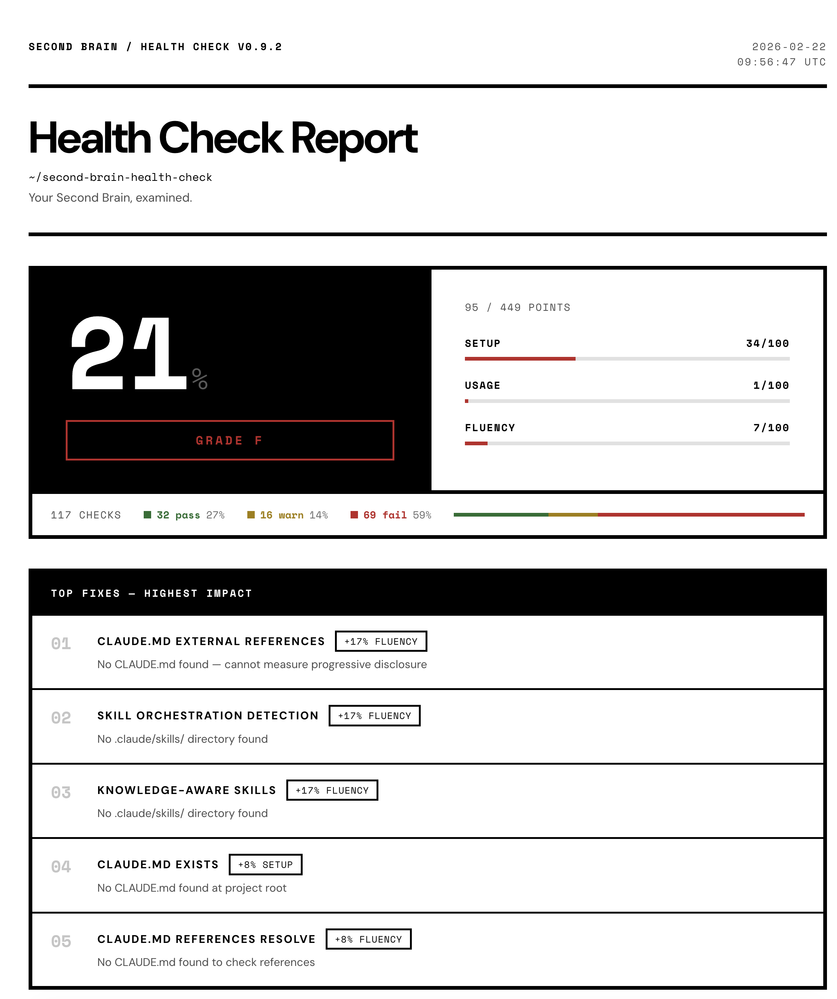
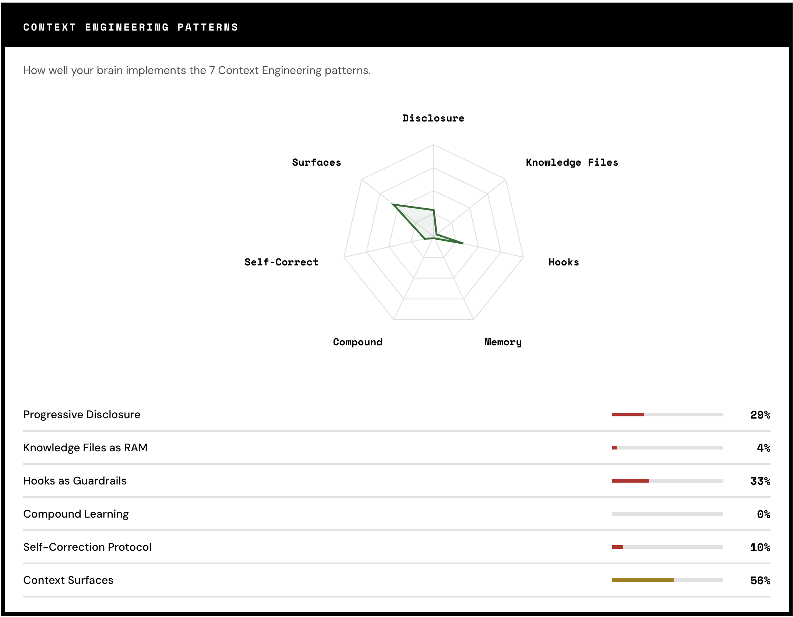
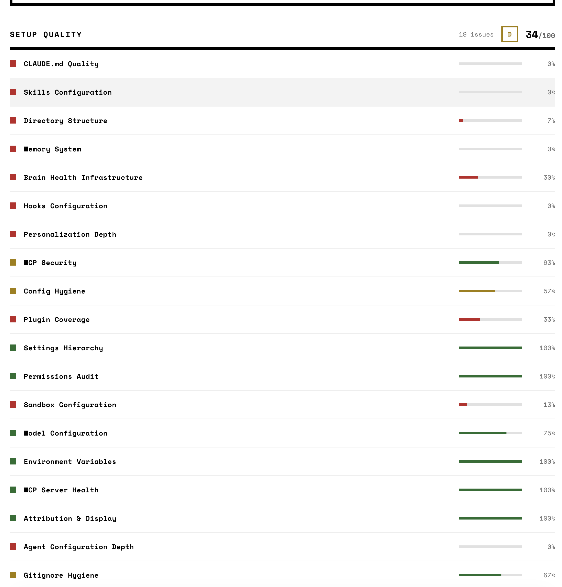

<h1 align="center">Second Brain Health Check</h1>

<p align="center">
<strong>Your Claude Code setup has 38 things that could be better. This finds them in 2 seconds.</strong>
</p>

<p align="center">
<a href="https://www.npmjs.com/package/second-brain-health-check"></a>
<a href="https://opensource.org/licenses/MIT"></a>
<a href="https://nodejs.org"></a>
<a href="https://modelcontextprotocol.io"></a>
</p>

<p align="center"><em>Context Engineering quality scanner for Claude Code</em></p>

Scores your Claude Code Second Brain — CLAUDE.md, skills, hooks, memory, and planning artifacts — across 38 check layers. Returns adaptive reports with Context Engineering pattern mapping, prioritized fixes, and time estimates. Zero network calls. Runs locally.

---

## Quick Start

### Terminal (one line, instant results)

```bash
npx second-brain-health-check
```

Scans your current directory and prints the report to stdout. No install required.

### Inside Claude Code (interactive, with follow-up)

1. Add the MCP server (once):
```bash
claude mcp add second-brain-health -- npx second-brain-health-check
```

2. Then ask Claude:
```
Run health check on current project
```

Claude will run the scan, interpret the results, and help you fix what it finds — interactively.

---

## What You Get

The report adapts to your brain's maturity level. No information overload for beginners, no hand-holding for experts.

<details open>
<summary><strong>Empty Brain -- Getting Started Guide</strong></summary>

```
  ================================================================
    SECOND BRAIN HEALTH CHECK
  ================================================================

  STATUS: No Second Brain detected.

  That is totally fine. Here is how to get started:

  ----------------------------------------------------------------
  GETTING STARTED (3 steps, ~20 minutes)
  ----------------------------------------------------------------

  STEP 1: Create CLAUDE.md (~5 min)
    Your AI's instruction manual. Start with:
    - Who you are and what you do
    - Your top 3-5 rules ("always do X", "never do Y")
    - Key tools and frameworks you use

  STEP 2: Add skills (~10 min)
    Create .claude/skills/ with YAML-frontmatter files
    that teach Claude your workflows.

  STEP 3: Set up memory (~5 min)
    Create .claude/memory/ for episodic and semantic
    context that persists across sessions.

  ================================================================
    See what a properly configured Second Brain looks like:
    https://www.iwoszapar.com/context-engineering
  ================================================================
```

</details>

<details open>
<summary><strong>Configured Brain -- Full Report with CE Patterns</strong></summary>

```
  ================================================================
    SECOND BRAIN HEALTH CHECK
  ================================================================

  SETUP QUALITY:    84/100 (B - Good foundation)
  USAGE ACTIVITY:   89/100 (Active - Brain is compounding)
  AI FLUENCY:       92/100 (Expert - Advanced AI collaboration)

  ----------------------------------------------------------------
  CONTEXT ENGINEERING PATTERNS (7 patterns)
  ----------------------------------------------------------------

  [pass] Progressive Disclosure       |||||||||||||.. 87%
  [pass] Knowledge Files as RAM       ||||||||||||||. 93%
  [warn] Hooks as Guardrails          |||||.......... 33%
  [pass] Three-Layer Memory           ||||||||||||... 80%
  [pass] Compound Learning            ||||||||||||||. 93%
  [pass] Self-Correction              |||||||||||.... 73%
  [pass] Context Surfaces             |||||||||||||.. 87%

  ----------------------------------------------------------------
  TOP FIXES (highest impact)
  ----------------------------------------------------------------

  1. Add profession-specific rules to CLAUDE.md (+3 pts setup, ~10 min)
     Include 2+ domain patterns (MEDDPICC, sprint, SEO, KPI, etc.)

  2. Add PreToolUse hook for file operations (+5 pts setup, ~15 min)
     Prevents accidental writes to protected paths.

  ================================================================
    2 points from Production-grade.
    Missing pattern: Hooks as Guardrails.
    https://www.iwoszapar.com/context-engineering
  ================================================================
```

</details>

### HTML Dashboard

Run `npx second-brain-health-check --dashboard` to generate a self-contained HTML report with semantic color coding, radar chart, and guided fixes.

<p align="center">

</p>

<p align="center">

</p>

<p align="center">

</p>

---

## What It Measures

Three dimensions. 38 check layers. ~424 raw points, normalized to `/100`.

```
  SETUP QUALITY        25 layers    ~249 pts
  ████████████████████████████████████████████░░░░░░  Structure & config
  A (85%+) | B (70%+) | C (50%+) | D (30%+) | F (<30%)

  USAGE ACTIVITY        7 layers    ~125 pts
  ████████████████████████████████████████████░░░░░░  Growth & patterns
  Active (85%+) | Growing (70%+) | Starting (50%+) | Dormant (30%+) | Empty (<30%)

  AI FLUENCY            6 layers     ~60 pts
  ████████████████████████████████████████████░░░░░░  Collaboration depth
  Expert (85%+) | Proficient (70%+) | Developing (50%+) | Beginner (30%+) | Novice (<30%)
```

### Adaptive Reports

Reports shift based on brain maturity, detected via a fast pre-scan (~100ms):

| Brain State | Score Range | Report Style |
|:--|:--|:--|
| **Empty** | No CLAUDE.md | 3-step getting-started guide with time estimates |
| **Minimal / Basic** | 1--40 | Growth mode: celebrates what exists, shows top 3 fixes only |
| **Structured+** | 41+ | Full report with all dimensions, CE patterns, and complete breakdown |

---

## Context Engineering Patterns

The scanner maps all 38 check layers to 7 Context Engineering patterns. This is the signal that separates a collection of files from a working system.

```
  ┌─────────────────────────────────────────────────────────────┐
  │  CE PATTERN                       COVERAGE                  │
  ├─────────────────────────────────────────────────────────────┤
  │                                                             │
  │  Progressive Disclosure    ██████████████░░  87%            │
  │  External doc refs, knowledge files, layered context        │
  │                                                             │
  │  Knowledge Files as RAM    ███████████████░  93%            │
  │  Knowledge base architecture, directory structure           │
  │                                                             │
  │  Hooks as Guardrails       █████░░░░░░░░░░  33%            │
  │  PreToolUse / PostToolUse hooks, rules system               │
  │                                                             │
  │  Three-Layer Memory        ████████████░░░  80%            │
  │  Episodic / semantic separation, session logs               │
  │                                                             │
  │  Compound Learning         ███████████████░  93%            │
  │  Review loops, compound evidence, workflow maturity         │
  │                                                             │
  │  Self-Correction           ███████████░░░░  73%            │
  │  Health infra, memory evolution, cross-references           │
  │                                                             │
  │  Context Surfaces          ██████████████░░  87%            │
  │  MCP servers, plugins, interaction config, context pressure │
  │                                                             │
  └─────────────────────────────────────────────────────────────┘
```

---

## Check Layers

<details>
<summary><strong>25 Setup Quality Layers</strong> -- CLAUDE.md, skills, hooks, memory, config, security</summary>

&nbsp;

| # | Layer | Pts | What It Checks |
|--:|:------|----:|:---------------|
| 1 | CLAUDE.md Foundation | 23 | Quick Start section, About Me, profession-specific rules, gotchas, length (2K--6K chars), freshness (14 days) |
| 2 | Skills & Commands | 24 | 2+ skills, YAML frontmatter, profession-relevant naming, 200+ char instructions |
| 3 | Directory Structure | 15 | Organized folders, separation of concerns |
| 4 | Memory Architecture | 15 | Episodic/semantic separation, not a single blob |
| 5 | Brain Health Infra | 10 | Health monitoring setup |
| 6 | Hooks | 19 | PreToolUse/PostToolUse hooks, coverage |
| 7 | Personalization | 10 | User-specific config |
| 8 | MCP Security | 8 | Server configuration safety |
| 9 | Config Hygiene | 7 | Clean settings, no stale config |
| 10 | Plugin Coverage | 6 | MCP server coverage |
| 11 | Settings Hierarchy | 12 | Project vs user vs global settings |
| 12 | Permissions Audit | 12 | Tool permissions configured |
| 13 | Sandbox Config | 8 | Sandbox boundaries set |
| 14 | Model Config | 8 | Model selection configured |
| 15 | Environment Variables | 10 | Env vars managed |
| 16 | MCP Server Health | 10 | MCP servers responding |
| 17 | Attribution & Display | 6 | Output styling, status line |
| 18 | Agent Config Depth | 8 | Custom agents with tool restrictions |
| 19 | Gitignore Hygiene | 6 | .env and local settings excluded from git |
| 20 | Team Readiness | 8 | Agent teams enabled, team artifacts |
| 21 | Rules System | 6 | `.claude/rules/` with scoped rule files |
| 22 | Interaction Config | 8 | Keybindings, output style, thinking mode |
| 23 | Spec & Planning | 10 | Plans/specs directories, structured requirements |
| 24 | Knowledge Base | 10 | `.claude/docs/` or `.claude/knowledge/` with domain context |
| 25 | Context Pressure | 10 | CLAUDE.md size, knowledge file distribution, total context surface, progressive disclosure |

</details>

<details>
<summary><strong>7 Usage Activity Layers</strong> -- session frequency, pattern growth, memory evolution</summary>

&nbsp;

Session logs, pattern files, memory file dates, review loop evidence, compound learning artifacts, cross-references between memory files, and workflow diversity across skill categories.

</details>

<details>
<summary><strong>6 AI Fluency Layers</strong> -- progressive disclosure, delegation, orchestration</summary>

&nbsp;

Progressive disclosure in CLAUDE.md, skill-to-agent delegation, context-aware skill design, file reference integrity (do paths in CLAUDE.md actually resolve?), multi-tier orchestration with model routing, and interview/spec-first patterns.

</details>

---

## MCP Tools

```
  ┌──────────────────────┬──────────────────────────────────────────────────┐
  │  check_health        │  Full 38-layer scan across 3 dimensions.        │
  │                      │  Supports 14 languages, workspace type          │
  │                      │  (solo/team/enterprise), use case context,      │
  │                      │  and mode (full/quick/manifest).                │
  │                      │  Adaptive report based on brain maturity.       │
  ├──────────────────────┼──────────────────────────────────────────────────┤
  │  get_fix_suggestions │  Focus on weakest dimension. Prioritized        │
  │                      │  action plan with time estimates.               │
  ├──────────────────────┼──────────────────────────────────────────────────┤
  │  generate_dashboard  │  Self-contained HTML dashboard. Refined          │
  │                      │  Brutalism design, mobile-responsive, CE radar  │
  │                      │  chart, terminal-style rows, fix guides.        │
  ├──────────────────────┼──────────────────────────────────────────────────┤
  │  generate_pdf        │  PDF report via headless Chrome.                │
  └──────────────────────┴──────────────────────────────────────────────────┘
```

**Modes:**
- `full` -- complete 38-layer scan with adaptive reporting
- `quick` -- detection-only pre-scan (~100ms)
- `manifest` -- machine-readable YAML output for CI/other tools

---

## v0.9.3 Highlights

- **Semantic color** -- pass (green `#1a7a3a`), warn (amber `#b08800`), fail (red `#cf222e`) on status dots, score bars, grade badges, check mini-dots, and radar chart polygon. All structural elements stay pure B&W.
- **Status tally strip** -- compact summary strip below the score panel showing total checks + pass/warn/fail counts with percentages and a colored stacked distribution bar
- **Dashboard screenshots** -- score panel, CE patterns radar, and setup quality rows now shown in README

### Previous releases

- **v0.9.0** -- Refined Brutalism dashboard (DM Sans + Space Mono, 4px borders), terminal-style expandable rows, CE radar chart, adaptive reports, WCAG AA
- **v0.9.1** -- Scanner accuracy: index file counter raised to 5000, topic area counting fixed
- **v0.9.2** -- Config line count fix (trailing newline handling)

---

## Security & Privacy

```
  ┌─ Security & Privacy Model ────────────────────────────────┐
  │                                                           │
  │  ◆ Runs entirely locally — zero network calls             │
  │  ◆ Zero telemetry — nothing is sent anywhere              │
  │  ◆ Reads file structure and config metadata only          │
  │  ◆ Never reads your code, emails, or documents            │
  │  ◆ Secret detection: reports "found/not found" only —     │
  │    your actual API keys are never shown in output         │
  │  ◆ Home directory boundary — cannot scan outside $HOME    │
  │  ◆ stdio transport only                                   │
  │  ◆ Path null-byte validation via Zod                      │
  │  ◆ File count limits (5000 max per directory scan)        │
  │  ◆ Recursion depth limits (3-4 levels)                    │
  │  ◆ All user content escaped in HTML output                │
  │                                                           │
  └───────────────────────────────────────────────────────────┘
```

Full security details: [SCORING.md -- Security Hardening](./SCORING.md#security-hardening)

---

## What Is a Claude Code Second Brain?

A "Second Brain" is the persistent context layer that lives alongside Claude Code — your CLAUDE.md, `.claude/` directory, skills, hooks, memory files, MCP servers, and planning artifacts. It's what makes Claude remember your preferences, follow your rules, and get smarter over time.

> Prompt engineering optimizes a single LLM call.
> Context engineering optimizes the persistent system surrounding those calls --
> the files, hooks, memory, and skills that shape every session.

This tool scores that **context engineering layer**, not your prompts.

---

## Documentation

| Document | Purpose |
|:---------|:--------|
| [SCORING.md](./SCORING.md) | Every check, threshold, regex, point value -- the source of truth |
| [CHANGELOG.md](./CHANGELOG.md) | Full version history from v0.1.0 to v0.9.3 |

---

<p align="center">

Part of the [Context Engineering](https://www.iwoszapar.com/context-engineering) product suite.
If your score reveals gaps, [Second Brain AI](https://www.iwoszapar.com/second-brain-ai) builds the full architecture.

Built by [Iwo Szapar](https://www.iwoszapar.com) -- AI Implementation Expert & Second Brain Architect.

</p>
