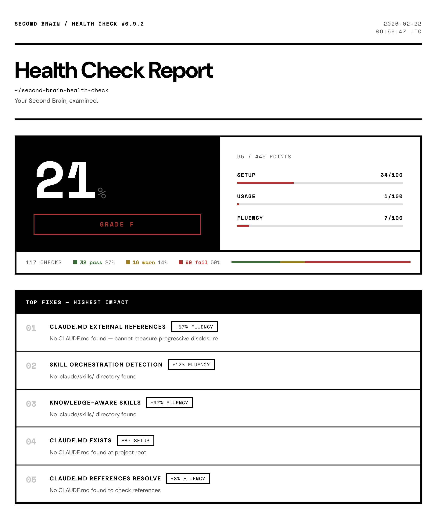
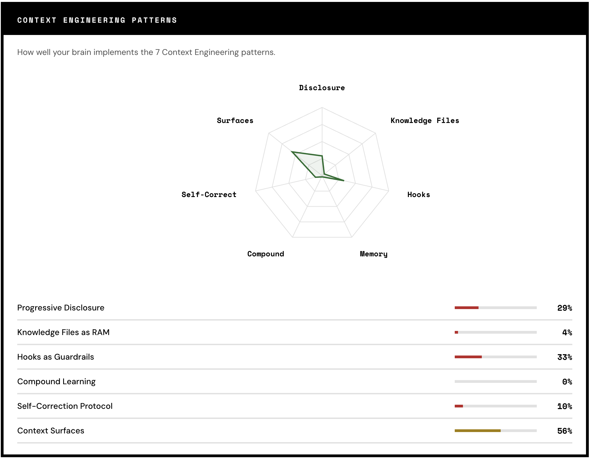
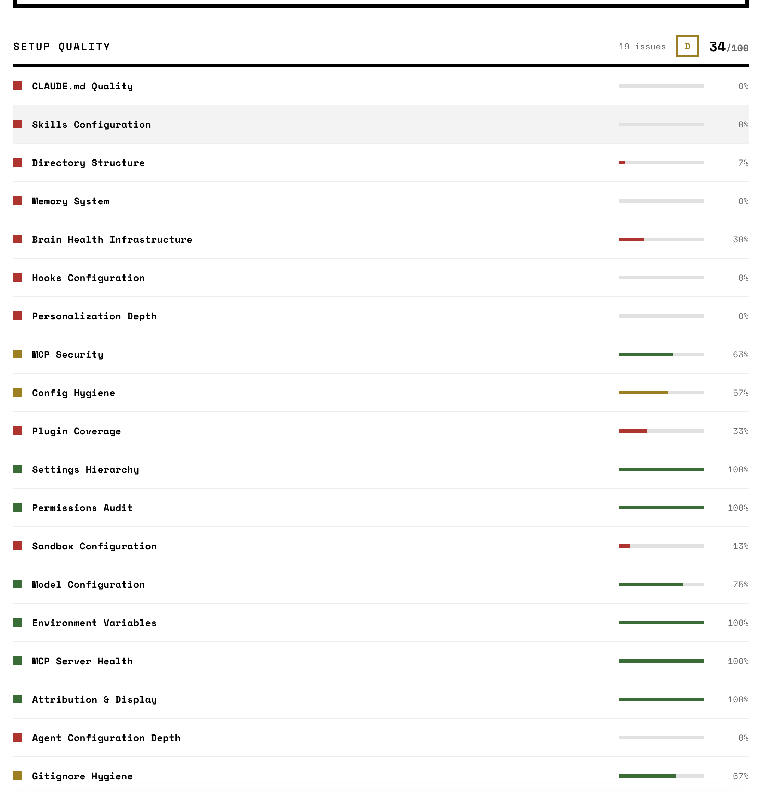

<h1 align="center">MemoryOS</h1>

<p align="center">
<strong>Your Claude Code setup has 45 things that could be better. This finds them in 2 seconds.</strong>
</p>

<p align="center">
<a href="https://www.npmjs.com/package/@iwo-szapar/second-brain-health-check"></a>
<a href="https://opensource.org/licenses/MIT"></a>
<a href="https://nodejs.org"></a>
<a href="https://modelcontextprotocol.io"></a>
</p>

<p align="center"><em>Open-source context engineering scanner for Claude Code</em></p>

Scores your Claude Code setup across 45 check layers and 3 dimensions. Returns adaptive reports with Context Engineering pattern mapping, prioritized fixes with time estimates, and an HTML dashboard. Free tools run locally with zero network calls. Paid tools unlock progress tracking, context analysis, conversation import, and AI-powered upgrades.

---

## Install

### One command setup

```bash
npx @iwo-szapar/second-brain-health-check setup
```

Interactive onboarding (~2 minutes):
1. Asks for your API key (or skip for free tier)
2. Configures the MCP server in Claude Code
3. Asks about your role, experience, and goals
4. Runs the first health check and opens the dashboard

### Manual MCP setup

```bash
claude mcp add second-brain-health-check -- npx @iwo-szapar/second-brain-health-check
```

Then ask Claude: "Run a health check on my project."

---

## Tools

### Free Tools

No API key required. Run locally, zero network calls.

#### `check_health`

Full 45-layer scan across setup quality, usage activity, and AI fluency. Adapts the report to your brain's maturity level.

```
> Run a health check

> Check my setup health in quick mode

> Run health check in Spanish
```

Parameters:

| Parameter | Default | Options |
|:----------|:--------|:--------|
| `path` | current directory | Path to project root |
| `mode` | `full` | `full` (45 layers), `quick` (~100ms detection only), `manifest` (full + YAML output) |
| `language` | `en` | `en`, `es`, `de`, `fr`, `pl`, `pt`, `ja`, `ko`, `zh`, `it`, `nl`, `ru`, `tr`, `ar` |
| `workspace_type` | -- | `solo`, `team`, `enterprise` |
| `use_case` | -- | `development`, `content`, `operations`, `research`, `mixed` |

#### `get_fix_suggestions`

Prioritized action plan for your weakest area. Each fix includes a time estimate and point value.

```
> What should I fix first in my setup?

> Give me fix suggestions focused on setup quality
```

Parameters:

| Parameter | Default | Options |
|:----------|:--------|:--------|
| `path` | current directory | Path to project root |
| `focus` | `auto` | `auto` (picks weakest), `setup`, `usage`, `fluency` |
| `language` | `en` | Same as check_health |

#### `generate_dashboard`

Self-contained HTML dashboard with score visualizations, CE radar chart, and guided fixes. Opens in your browser.

```
> Generate a health check dashboard

> Generate dashboard and save to ~/reports/brain.html
```

Parameters:

| Parameter | Default | Options |
|:----------|:--------|:--------|
| `path` | current directory | Path to project root |
| `output` | `health-check-report.html` | Output file path |

#### `generate_pdf`

PDF report via headless Chrome. Requires Chrome or Chromium installed.

```
> Generate a PDF health check report
```

Parameters:

| Parameter | Default | Options |
|:----------|:--------|:--------|
| `project_path` | *(required)* | Absolute path to project |

---

### Paid Tools

Require an API key. Set `SBF_TOKEN` in your environment or run `setup` to configure.

#### `weekly_pulse`

Track progress over time. Shows score deltas, CE pattern trends, streak detection, and targeted suggestions.

```
> Show my weekly pulse

> Show my progress over the last 30 days
```

Parameters:

| Parameter | Default | Options |
|:----------|:--------|:--------|
| `period` | `since_last` | `since_last`, `7d`, `30d` |
| `path` | current directory | Path to project root |

#### `context_pressure`

Analyze how much of your 200K token context window is consumed by fixed overhead -- CLAUDE.md, MEMORY.md, knowledge files, MCP definitions, skills, hooks, and settings.

```
> Check my context pressure

> How much of my context window am I using?
```

Parameters:

| Parameter | Default | Options |
|:----------|:--------|:--------|
| `path` | current directory | Path to project root |

#### `audit_config`

Audit your configuration for dead references, conflicts, security issues, unused items, and performance problems.

```
> Audit my config

> Run a security audit on my setup
```

Parameters:

| Parameter | Default | Options |
|:----------|:--------|:--------|
| `path` | current directory | Path to project root |
| `check_categories` | all 5 | `references`, `conflicts`, `security`, `unused`, `performance` |

**What each category checks:**
- **references** -- Dead file paths in CLAUDE.md, missing hook scripts
- **conflicts** -- Duplicate CLAUDE.md files, overlapping MCP servers, unmatched hooks
- **security** -- `.env` in `.gitignore`, API key patterns in config files, wildcard permissions
- **unused** -- Skills with zero invocations in session logs
- **performance** -- Oversized CLAUDE.md (>300 lines), MEMORY.md (>180 lines), too many MCP tools (>30)

#### `import_context`

Import conversation history from ChatGPT or Claude exports into organized memory files. Scan first to preview, then import to create files.

```
> Scan my ChatGPT export at ~/Downloads/conversations.json

> Import my ChatGPT conversations, only coding-related ones from 2025
```

Parameters:

| Parameter | Default | Options |
|:----------|:--------|:--------|
| `source_type` | *(required)* | `chatgpt_export` (conversations.json) or `claude_export` (directory) |
| `source_path` | *(required)* | Path to export file or directory |
| `mode` | `scan` | `scan` (preview only) or `import` (write files) |
| `output_dir` | `memory/imported/` | Where to write imported files |
| `max_conversations` | unlimited | Limit conversations processed |
| `min_messages` | `3` | Skip short conversations |
| `date_after` | -- | ISO date filter (e.g. `2024-01-01`) |
| `date_before` | -- | ISO date filter |
| `categories` | all | `coding`, `writing`, `research`, `planning`, `data`, `creative`, `operations` |
| `merge_existing` | `false` | When true, writes to `memory/semantic/` instead |
| `language` | `en` | Output language |

#### `upgrade_brain`

Identify missing and outdated files in your setup and generate personalized upgrades. Runs health check and inventory locally, then calls the Factory API for template matching and personalization. Requires `UPGRADE_BRAIN_API_KEY`.

```
> Upgrade my brain

> Show me what files I'm missing (dry run)

> Upgrade brain, high impact only
```

Parameters:

| Parameter | Default | Options |
|:----------|:--------|:--------|
| `path` | current directory | Path to project root |
| `high_only` | `false` | Only show HIGH impact files |
| `category` | all | `agent`, `skill`, `memory`, `config`, `docs` |
| `dry_run` | `false` | Preview the diff without applying |

---

## CLI

```bash
# First-time setup (interactive)
npx @iwo-szapar/second-brain-health-check setup

# Run health check (prints report + opens dashboard)
npx @iwo-szapar/second-brain-health-check

# Scan a specific directory
npx @iwo-szapar/second-brain-health-check /path/to/project

# Text report only (no browser)
npx @iwo-szapar/second-brain-health-check --no-open

# Generate PDF report
npx @iwo-szapar/second-brain-health-check --pdf
```

---

## What It Measures

Three dimensions. 45 check layers. ~459 raw points, normalized to /100 each.

```
SETUP QUALITY      32 layers    ~284 pts
A (85%+) | B (70%+) | C (50%+) | D (30%+) | F (<30%)

USAGE ACTIVITY      7 layers    ~125 pts
Active (85%+) | Growing (70%+) | Starting (50%+) | Dormant (30%+) | Empty (<30%)

AI FLUENCY          6 layers     ~60 pts
Expert (85%+) | Proficient (70%+) | Developing (50%+) | Beginner (30%+) | Novice (<30%)
```

### Adaptive Reports

Reports shift based on brain maturity:

| Brain State | Condition | Report Style |
|:--|:--|:--|
| **Empty** | No CLAUDE.md | 3-step getting-started guide (~20 min) |
| **Minimal** | Small CLAUDE.md, no .claude/ | Growth mode: top 3 fixes, celebrates what exists |
| **Basic** | CLAUDE.md + .claude/ | Growth mode |
| **Structured** | Has skills or hooks or memory | Full report with all dimensions |
| **Configured** | Has skills + hooks + memory | Full report with CE patterns |

### Context Engineering Patterns

All 45 layers map to 7 CE patterns:

| Pattern | What It Measures |
|:--------|:-----------------|
| Progressive Disclosure | CLAUDE.md layering, knowledge files, settings hierarchy |
| Knowledge Files as RAM | Knowledge base architecture, directory structure |
| Hooks as Guardrails | PreToolUse/PostToolUse hooks, rules system |
| Three-Layer Memory | Episodic/semantic separation, session logs |
| Compound Learning | Review loops, compound evidence, workflow maturity |
| Self-Correction | Health infra, memory evolution, cross-references |
| Context Surfaces | MCP servers, plugins, interaction config, context pressure |

---

## HTML Dashboard

<p align="center">

</p>

<p align="center">

</p>

<p align="center">

</p>

---

## Security and Privacy

- Runs entirely locally -- zero network calls on free tier
- Zero telemetry on free tier
- Reads file structure and config metadata only -- never reads your code, emails, or documents
- Secret detection reports "found/not found" only -- actual key values are never shown
- Home directory boundary -- cannot scan outside `$HOME`
- Path validation via Zod (no null bytes, length limits)
- File count limit: 5,000 per directory scan
- Recursion depth: 3-4 levels max
- All user content escaped in HTML output
- stdio transport only

**Paid tools:** `weekly_pulse`, `context_pressure`, `audit_config`, and `import_context` make zero network calls (they only read local files). `upgrade_brain` sends anonymized scores and file inventory to the Factory API for template matching -- no file contents are sent.

---

## Free vs Paid

| | Free | Paid |
|:--|:--|:--|
| `check_health` | 45-layer scan | Same |
| `get_fix_suggestions` | Prioritized fixes | Same |
| `generate_dashboard` | HTML dashboard | Same |
| `generate_pdf` | PDF report | Same |
| `weekly_pulse` | -- | Score deltas + trends |
| `context_pressure` | -- | Token budget analysis |
| `audit_config` | -- | Config audit (5 categories) |
| `import_context` | -- | ChatGPT/Claude import |
| `upgrade_brain` | -- | AI-powered file generation |
| Score tracking | Local `.health-check.json` | Local + server (benchmark-ready) |
| Network calls | Zero | `upgrade_brain` only |

Get access: [iwoszapar.com/memory-os](https://www.iwoszapar.com/memory-os)

---

## Documentation

| Document | Purpose |
|:---------|:--------|
| [SCORING.md](./SCORING.md) | Every check, threshold, regex, and point value |
| [CHANGELOG.md](./CHANGELOG.md) | Version history |

---

## What Is Context Engineering?

> Prompt engineering optimizes a single LLM call.
> Context engineering optimizes the persistent system surrounding those calls --
> the files, hooks, memory, and skills that shape every session.

Your CLAUDE.md, `.claude/` directory, skills, hooks, memory files, MCP servers, and planning artifacts form a persistent context layer. MemoryOS scores that layer -- not your prompts.

---

## Troubleshooting

### Migrating from `@iwo-szapar/memoryos`

The old package `@iwo-szapar/memoryos` is deprecated. If you see `Memoryos [tool_name]` (capital M) in your tool output, you're on the old package.

**Claude Code CLI:**

```bash
claude mcp remove memoryos
claude mcp remove second-brain-health-check
npm cache clean --force
claude mcp add second-brain-health-check -- npx @iwo-szapar/second-brain-health-check@latest
```

**Claude Desktop / Cowork:**

The CLI commands above only modify Claude Code config (`.claude.json`). Claude Desktop stores MCP config in a separate file:

- **macOS:** `~/Library/Application Support/Claude/claude_desktop_config.json`
- **Windows:** `%APPDATA%\Claude\claude_desktop_config.json`
- **Linux:** `~/.config/Claude/claude_desktop_config.json`

Open that file, find the old `"memoryos"` entry under `"mcpServers"`, and replace it with:

```json
"second-brain-health-check": {
  "command": "npx",
  "args": ["@iwo-szapar/second-brain-health-check@latest"],
  "env": {
    "SBK_TOKEN": "your_sbk_token_here"
  }
}
```

Then restart the app.

### Windows: path errors

If you see `Path "c:\Users\..." is outside the home directory`, the drive letter casing doesn't match. Fixed in v0.17.2+. Update with:

```bash
npm cache clean --force
```

Then re-run the tool. The server picks up the latest version on next invocation.

### Stale npx cache

If fixes don't take effect after updating, npx may be serving a cached old version. Signs: error messages reference `UPGRADE_BRAIN_API_KEY` (removed in v0.17.2), or tool output lacks the `[MemoryOS vX.Y.Z]` version prefix.

```bash
npm cache clean --force
npx clear-npx-cache
```

### How to check your version

Every tool response starts with `[MemoryOS v0.17.4]` (or your installed version). If you don't see this prefix, you're on v0.17.3 or older.

---

<p align="center">

[MemoryOS](https://www.iwoszapar.com/memory-os) by [Iwo Szapar](https://www.iwoszapar.com). MIT License.

</p>
